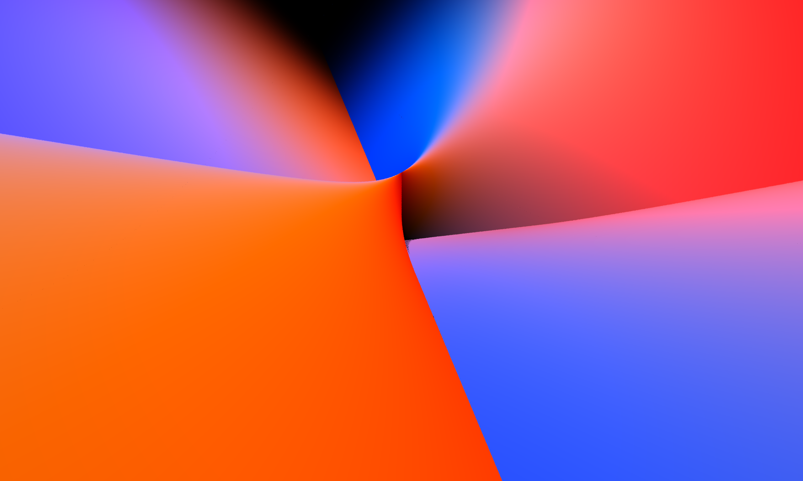
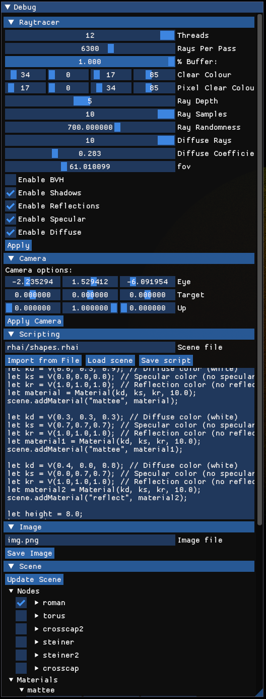

# Graphics Project

# Introduction



This is a project I undertook at the University of Waterloo, where I first started using rust. Because of my inexperience, the code isn't as organised as it would be if I made it today and represents my first steps in computer graphics and the rust language.

My unique aim was to perform ray intersections on special geometric surfaces, such as the CrossCap surface and the Steiner surface, hence those are among my _primitives_.

# Installation

Clone and run with `cargo run`, however much better performance will be granted with `cargo run --release`.



# Rhai

Rhai is used as an interactive scripting lang for this project. Examples are found in `rhai/`.

## Full List of rhai commands

```
/// Basic math types

V(x : float, y : float, z : float) -> Vector3
    // 3‑dimensional vector, used for directions, colors, etc.

P(x : float, y : float, z : float) -> Position3
    // 3‑dimensional position vector, used for points in space.


/// Scene and graph

Scene() -> Scene
    // Create an empty scene with no nodes, lights, or camera.

Scene.addNode(node : Node) -> void
    // Add a node (with geometry or camera) to the scene.

Scene.addLight(light : Light) -> void
    // Add a light source to the scene.

Scene.setCamera(camera : Camera) -> void
    // Set the active camera for this scene.


/// Nodes and transforms

Node() -> Node
    // Create an empty node (no mesh / camera / light by default).

Node.translate(x : float, y : float, z : float) -> Node
    // Apply translation by vector V(x, y, z) in local space, returns self for chaining.

Node.rotate(x : float, y : float, z : float) -> Node
    // Rotate node by Euler angles (in radians or degrees, implementation‑defined).

Node.scale(x : float, y : float, z : float) -> Node
    // Non‑uniform scale in local space.

Node.setMaterial(material : Material) -> Node
    // Set material for this node's mesh (if any).


/// Camera

Camera(position : P, target : P, up : V) -> Camera
    // Create a camera located at `position`, looking at `target`, with `up` as the up direction.


/// Lighting

Ambient(color : V) -> AmbientLight
    // Ambient light contribution with RGB in [0, 1].

Light(position : P, color : V, falloff : V) -> PointLight
    // Point light at `position` with RGB `color` and falloff parameters (constant, linear, quadratic).


/// Materials

Material(kd : V, ks : V, kr : V, shininess : float) -> Material
    // Phong‑style material:
    //   kd: diffuse color
    //   ks: specular color
    //   kr: reflection / mirror color
    //   shininess: specular exponent.

MaterialRed() -> Material
MaterialBlue() -> Material
MaterialGreen() -> Material
MaterialMagenta() -> Material
MaterialTurquoise() -> Material
    // Convenience materials with predefined colors.


/// Primitives

Sphere(pos : P, radius : float) -> Mesh
    // Sphere centered at `pos` with given radius.

SphereUnit() -> Mesh
    // Unit sphere at (0, 0, 0) with radius 1.

Cube(pos : P, radius : float, normal : V) -> Mesh
    // Cube centered at `pos`, edge length = 2 * radius (or radius, implementation‑defined),
    // `normal` can define an orientation axis.

CubeUnit() -> Mesh
    // Unit cube at (0, 0, 0).

Cone(radius : float, height : float) -> Mesh
    // Cone aligned with +Z (for example), base radius and height.

ConeUnit() -> Mesh
    // Cone with radius 1 and height 1 at the origin.

Cylinder(radius : float, height : float) -> Mesh
    // Cylinder aligned with +Z, given radius and height.

CylinderUnit() -> Mesh
    // Cylinder with radius 1 and height 1 at the origin.

Circle(position : P, radius : float, normal : V) -> Mesh
    // Flat disk at `position` with `normal` orientation and given radius.

CircleUnit() -> Mesh
    // Unit circle in the XY plane at the origin.

Rectangle(position : P, size : V, normal : V) -> Mesh
    // Axis‑aligned rectangle centered at `position`, width/height from size.x / size.y, oriented by `normal`.

RectangleUnit() -> Mesh
    // 1x1 rectangle in the XY plane centered at origin.


/// Special / parametric surfaces

Steiner() -> Mesh
    // A Steiner surface with default parameters and resolution.

Torus(radiusMajor : float, radiusMinor : float) -> Mesh
    // Torus with major and minor radius, centered at origin.

Roman() -> Mesh
    // Roman surface with default scale and resolution.

CrossCap() -> Mesh
    // Cross‑cap surface (Boy's surface variant / projective plane immersion).

Gnonom() -> Mesh
    // Gnomon‑like parametric surface (implementation‑defined shape).

```
